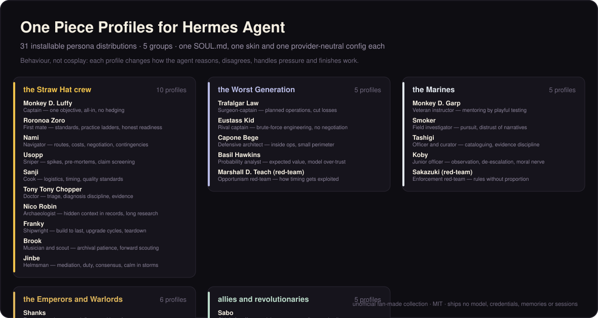

# One Piece Profiles for Hermes Agent



A collection of comprehensive, installable Hermes Agent personas inspired by characters from
**One Piece**.

Each character is a separate Hermes [profile distribution](https://hermes-agent.nousresearch.com/docs/user-guide/profile-distributions). The profile changes how Hermes reasons, communicates, disagrees, handles pressure, and collaborates. It does not turn Hermes into a shallow quote generator or remove its normal tools and factual standards.

## What each profile contains

- A substantial `SOUL.md` covering identity, voice, worldview, operating method, strengths, blind spots, pressure behavior, disagreement style, safeguards, and task affinities
- A character-branded terminal skin
- A provider-neutral `config.yaml`
- A standard `distribution.yaml`

No profile ships credentials, memories, sessions, conversation history, a model choice, cron jobs, or MCP servers. Your provider setup remains yours.

## The collection

Thirty-one profiles across five groups. Each group has its own palette, so a skin tells you which register you are in:

| Series | Members | Work it suits |
|---|---|---|
| `Straw-Hats` | 10 | shipping real work under uncertainty: cutting scope, unblocking, practice plans, logistics, prototyping |
| `Worst-Generation` | 5 | contested, high-stakes planning: operations, loss-cutting, probability and opportunism red-team |
| `Marines` | 5 | investigation, evidence, institutional work, mentoring, enforcement red-team |
| `Emperors-and-Warlords` | 6 | leverage without force, craft mastery, improvisation, anticipation, triage, manipulation red-team |
| `Allies-and-Revolutionaries` | 5 | negotiation, coordination across distance, duty versus feeling, long-horizon guardianship, tutoring |

`silvers-rayleigh` is the tutor: it diagnoses what a learner can actually do unaided, sets work one step beyond it, designs mastery gates and spaced review, and refuses to hand over the answer while an honest path to it remains open. It is the collection's teaching profile — closest in spirit to the `rayleigh` crew profile this repo's author runs for their own Go/backend study plan.

Browse the collection:

```bash
python3 manage.py list
python3 manage.py list --series Marines
```

The generated catalog lives in [`catalog.json`](./catalog.json), and every installable distribution is under [`profiles/`](./profiles/). The human-readable [roster](./ROSTER.md) shows the full collection and the work each persona suits.

## Install

Clone once, then install any combination:

```bash
git clone https://github.com/akashgagda/hermes-one-piece-profiles.git
cd hermes-one-piece-profiles

# One profile
python3 manage.py install monkey-d-luffy --alias

# A whole series
python3 manage.py install --series Marines --alias

# The complete collection
python3 manage.py install --all --alias
```

One-line bootstrap on Linux/macOS:

```bash
curl -fsSL https://raw.githubusercontent.com/akashgagda/hermes-one-piece-profiles/main/install.sh | sh -s -- monkey-d-luffy --alias
```

The one-liner follows mutable `main`; inspect it before use. For a reproducible install, clone a tagged release or commit SHA, review the checkout, then run `python3 manage.py install ...`. The manager prints a SHA-256 of every selected profile payload before installation.

PowerShell:

```powershell
$script = irm https://raw.githubusercontent.com/akashgagda/hermes-one-piece-profiles/main/install.ps1
& ([scriptblock]::Create($script)) monkey-d-luffy --alias
```

Start the installed profile with either form:

```bash
monkey-d-luffy chat
# or
hermes -p monkey-d-luffy chat
```

Profile identity is loaded when a session starts. Start a new session after installing or updating.

## Why the collection has an installer

Hermes accepts a local directory containing `distribution.yaml`, while a remote Git install expects that manifest at the repository root. This repository contains many distributions, so `manage.py` selects the requested character directories and hands each one to Hermes' native installer. It adds no alternate profile format and writes no profile state itself.

## Update

```bash
cd hermes-one-piece-profiles

# Review and fast-forward the collection, then update selected profiles
git pull --ff-only
python3 manage.py update monkey-d-luffy nico-robin

# Update every installed profile from this collection
python3 manage.py update --all
```

Hermes' distribution updater replaces `SOUL.md` and the skin while preserving local memories, sessions, credentials, and `config.yaml`. Pass `--force-config` if you also want to restore the distribution's skin selection. `manage.py update --pull ...` is a convenience for explicitly opting into the fast-forward before updating.

Keep the collection checkout if you want native `hermes profile update` to keep working: current Hermes records a local absolute source path for monorepo-selected distributions. Moving the checkout requires reinstalling the affected profiles from the new location. `manage.py install --force` also replaces `config.yaml`; it preserves memories and sessions, not local config overrides.

## Development

Persona source data is in `source/*.json` — one array of persona objects per file, any number of files. Generated distributions are deterministic.

```bash
python3 tools/check_source.py                  # validate every source file against the schema
python3 tools/build_collection.py              # regenerate profiles/, catalog.json, ROSTER.md
python3 tools/build_collection.py --check      # fail if generated output is stale
python3 tools/validate_collection.py           # structural and content checks (needs PyYAML)
python3 tools/e2e_collection.py                # install every profile, then update one (needs hermes)
```

`tools/check_source.py` imports the same field contract the builder uses, so a file that passes it builds. The validator additionally enforces what the builder cannot: every SOUL is at least 3,000 characters, carries all fourteen required sections and the non-negotiable boundary text, differs from every other profile by substance rather than by name, and that character skins inside a series are actually distinct.

`tools/e2e_collection.py` is guarded on purpose. On Hermes 0.21.x the profiles root resolves from the **default** Hermes home (`~/.hermes/profiles`), not from the `HERMES_HOME` the script sets, so it installs thirty real profiles into a real profile list. It refuses to run without `HERMES_OP_E2E=1`; set that only in a container or on a throwaway machine. CI sets it.

When adding a character, stop if there is not enough stable behavioral signal to justify a distinct agent. Depth beats roster inflation.

## Design principles

- **Behavior over cosplay.** A persona should change how the agent approaches work, not sprinkle dialogue references over generic answers.
- **Useful asymmetry.** Luffy, Zoro, Nami, Law, Koby, Mihawk, Katakuri and Marco should solve the same problem differently.
- **Character limits survive.** Blind spots are modeled, then bounded by explicit failure-mode guards so they add texture without making the agent worse or unsafe.
- **User agency stays intact.** Rank, authority, intimacy, loyalty, and fictional history are never imposed on the user.
- **Original wording only.** The profiles use no scripts, copied dialogue, character art, logos, episode text, or catchphrases.
- **Provider neutral.** The collection does not assume a particular model or API key.

## Rights and attribution

This is an unofficial, non-commercial fan-made collection for Hermes Agent. One Piece and its characters are the property of Eiichiro Oda, Shueisha, Toei Animation and their respective rights holders. This repository is not affiliated with or endorsed by any of them.

The repository contains behavioral descriptions written in original language. It includes no franchise logos, promotional art, scripts, episode transcripts, audio, video, or copied dialogue.

The collection structure — the `source/` schema, the generator, the validator, `manage.py`, and the installers — is adapted from [teknium1/hermes-star-trek-profiles](https://github.com/teknium1/hermes-star-trek-profiles) (MIT), with thanks. Code and original profile text here are released under the MIT License, subject to all third-party rights in the underlying fictional characters and setting.
